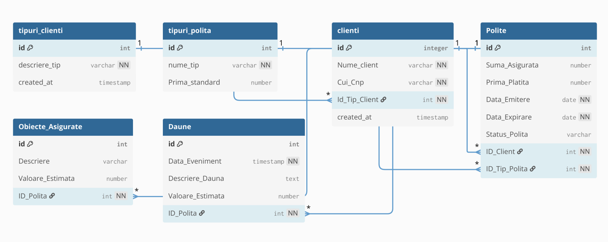

# Insurance Management System (Relational Database)

### 📌 Project Overview
This project focuses on designing a robust database system for a general insurance company. It was developed to centralize the entire lifecycle of an insurance contract—from client onboarding and policy issuance to claims processing and asset management.

### 🛠️ Technical Features
* **3rd Normal Form (3NF)**: The database schema is fully normalized to eliminate data redundancy and ensure logical dependency.
* **Data Integrity**: Implemented using `PRIMARY KEY`, `FOREIGN KEY`, `NOT NULL`, `UNIQUE`, and `CHECK` constraints (e.g., ensuring positive insured sums).
* **Schema Evolution**: Includes `ALTER TABLE` scripts demonstrating the ability to maintain and update database structures (e.g., adding email fields and capacity upgrades).

### 🏗️ Database Structure
The system is organized into 6 interconnected tables using **1:N (One-to-Many) relationships**:

1.  **Nomenclature Tables (Reference)**:
    * `PR_TIPURI_CLIENTI`: Standardizes client categories (e.g., Individual, VIP, NGO).
    * `PR_TIPURI_POLITA`: Manages policy types and standard premiums (e.g., RCA, CASCO, Life).
2.  **Main Tables**:
    * `PR_CLIENTI`: Stores identification and contact details.
    * `PR_POLITE`: The core of the system, linking clients to specific insurance products and contract terms.
3.  **Detail Tables**:
    * `PR_OBIECTE_ASIGURATE`: Describes the specific assets protected by a policy (e.g., vehicles, real estate).
    * `PR_DAUNE`: Logs all incidents and claim estimations associated with active policies.

### 📐 Database Design Schema
The visual representation of the database structure, including table relationships and constraints, was designed using [dbdiagram.io](https://dbdiagram.io/).

  

### 🔍 Sample Business Analytics
Here are a few examples of the analytical queries included in the project:

* **Active Policies Overview**: Retrieves all active contracts with full client and policy type details using multi-table JOINs.
* **Claims Financial Analysis**: Calculates the total value of claims recorded for each individual policy.
* **Contract Classification**: Categorizes insurance policies into 'Short Term' or 'Long Term' using conditional logic (CASE statements).

> [!TIP]
> You can find the full list of 10 complex queries and the complete database setup in the [insurance_db.sql](./insurance_db.sql) file.

### 💻 Tech Stack
* **Database Engine**: Oracle SQL
* **Tools**: Oracle SQL Developer
* **Modeling**: Relational Modeling, 3rd Normal Form (3NF)
